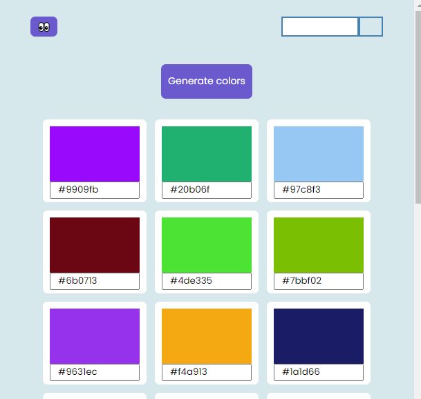

### Color  css
 

an awesome color picker that helps css and front end developers in theiYou can check the hex code of any website and also can generate different colors for various use in your development process.r development processes.

<b> 
Install the extension here <a href="https://chrome.google.com/webstore/detail/color-css/adlacpihapeklogkiembneaaaabciaio">Here</a>
</b>
      
 

